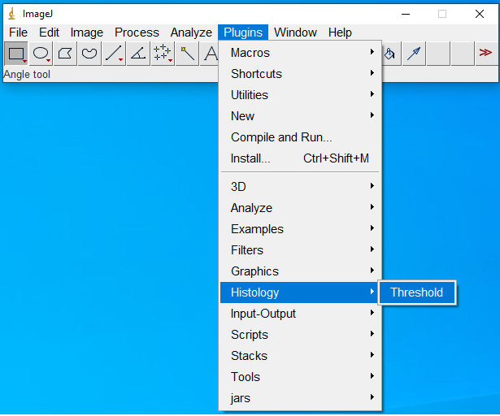
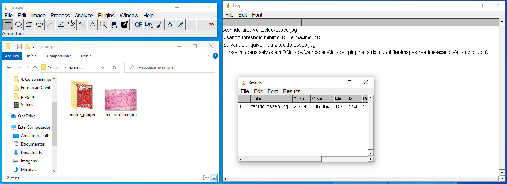

# imagej-plugin-histology-ufu
Plugin ImageJ para automatização do processamento de imagens histológicas a fim de quantificação dá matriz óssea.

## Como usar
Inicialmente, faça o download do software ImageJ, disponível em https://imagej.nih.gov/ij/download.html.

### Em seguida
Faça o download do arquivo `matrix_quantifier-0.0.1.jar`, e cole-o na pasta `plugins` do diretório onde foi feita a instalação do ImageJ.

Execute o ImageJ e procure pelo menu `Plugin/Histology/Threshold`, conforme a imagem abaixo:

 

Uma janela irá aparecer, selecione a pasta onde estão contidas as imagens a serem processadas e clique em OK.

Quando o processo terminar, uma nova pasta, chamada `matriz_plugin`, será gerada com as novas imagens, com a matriz óssea destacada em vermelho. Uma janela com os resultados individuais de cada imagem contabilizando algumas informações da matriz óssea, tais como perímetro, área, etc.

Um exemplo do resultado final é mostrado abaixo:

 

Na janela de *Results* é possível exportar os dados resultantes como `.csv`.
